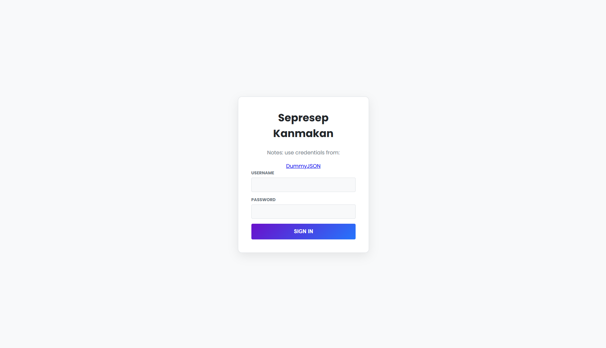
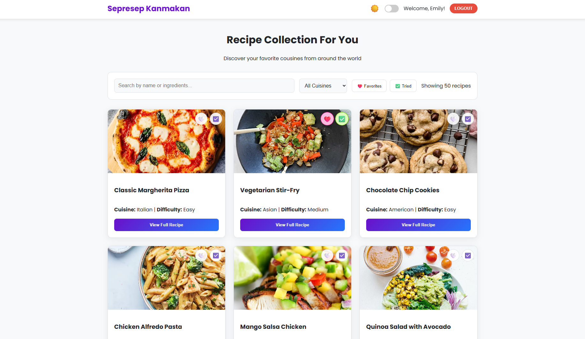
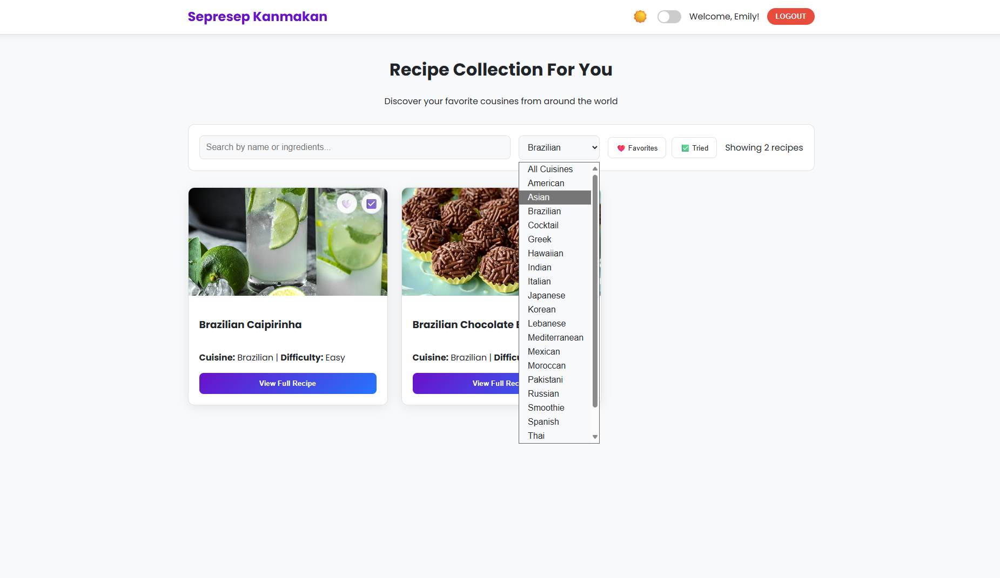

# PWEB-JS-P11-2025

|No  | Nama                   | NRP
|----|------------------------|---------
|1   | Zidny Ilman Nafi`an	  | 5027221072
|2   | Ananda Fitri Wibowo	  | 5027241057
|3   | Ahmad Yazid Arifuddin  |	5027241040


## Sepresep Kanmakan – Recipe Collection

Proyek web sederhana untuk login dan menjelajah koleksi resep masakan. Setelah login, pengguna bisa mencari, memfilter, menandai favorit, menandai sudah dicoba, melihat detail resep, serta mengaktifkan mode gelap. Autentikasi menggunakan API publik DummyJSON.

## Dokumentasi
#### Login Page

#### Recipes Page

#### Filter by cuisine



### Fitur Utama
- **Login Page (DummyJSON)**: Kirim `username` dan `password` ke API `https://dummyjson.com/auth/login`.
- **Proteksi halaman resep**: Jika belum login, halaman `recipes.html` menampilkan overlay dan tombol ke `index.html`.
- **Pencarian & Filter**: Cari berdasarkan nama/ingredient, filter berdasarkan `cuisine`.
- **Detail Resep (Modal)**: Lihat gambar, rating, waktu masak, ingredient, dan instruksi.
- **Logout dengan konfirmasi**: Dialog konfirmasi sebelum keluar.

### Fitur Tambahan
- **Dark mode**: Toggle tema terang/gelap, tersimpan di `localStorage`.
- **Favorit & Tried**: Tandai resep sebagai favorit atau sudah dicoba (persist di `localStorage`, per pengguna).
- Simpan preferensi tiap akun agar tidak hilang setelah logout
  
### Teknologi yang Dipakai
- **HTML5, CSS3 (Poppins font), JavaScript murni**
- **API publik**: `https://dummyjson.com` untuk login dan daftar resep
- **LocalStorage** untuk menyimpan sesi ringan dan preferensi UI
  
### Struktur Proyek
```
pweb-js-p11-2025/
  index.html        -> Halaman login
  recipes.html      -> Halaman koleksi resep (terproteksi)
  css/style.css     -> Gaya tampilan, termasuk dark mode dan komponen UI
  js/auth.js        -> Blokir akses jika belum login (di recipes.html)
  js/login.js       -> Alur login dan penyimpanan sesi
  js/recipes.js     -> Fetch resep, filter, favorit/tried, modal detail, dark mode, logout
  recipe.png        -> Favicon
```

### Cara Menjalankan (Lokal)
1. Unduh/clone repo ini.
2. Buka file `index.html` langsung di browser, atau gunakan ekstensi Live Server (VS Code) agar path relatif stabil.
3. Login menggunakan kredensial dari DummyJSON. Contoh (cek daftar lengkap di `https://dummyjson.com/users`):
   - `username`: `emilys`
   - `password`: `emilyspass`
4. Setelah login berhasil, Anda akan diarahkan ke `recipes.html`.

Catatan: Karena ini aplikasi client-side, beberapa browser membatasi fetch dari file lokal (file://). Jika data resep tidak muncul saat dibuka langsung, jalankan dengan Live Server atau server statis sederhana.

### Alur Login Singkat
- Form `index.html` mengirim `username` dan `password` ke `https://dummyjson.com/auth/login`.
- Jika sukses, aplikasi menyimpan ke `localStorage`:
  - `userFirstName`, `userToken`, `currentUsername`
- Pengguna dialihkan ke `recipes.html`.
- `recipes.html` akan memblokir akses jika `userFirstName` tidak ada (overlay redirect ke login).

### Data & Penyimpanan Lokal
- Tema: `theme` bernilai `light` atau `dark`.
- Preferensi per pengguna (dibedakan dengan prefix `currentUsername`):
  - `${username}_favoriteRecipes` -> array `id` resep favorit
  - `${username}_triedRecipes`    -> array `id` resep yang sudah dicoba

### API yang Diakses
- Login: `POST https://dummyjson.com/auth/login`
- Resep (semua): `GET https://dummyjson.com/recipes?limit=0`
- Detail resep: `GET https://dummyjson.com/recipes/{id}`


